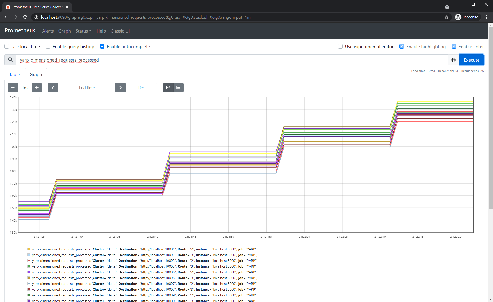

# YARP Prometheus sample

This sample demonstrates how to use the ReverseProxy.Telemetry.Consumption library to listen to telemetry data from YARP and then to publish them as a endpoint for Prometheus to consume.

This sample uses the [prometheus-net](https://github.com/prometheus-net/prometheus-net) library to expose Counters, Gauges & Histograms to Prometheus, which makes exposing the telemetry much easier.

Internally YARP uses EventCounters to collect telemetry events and metrics from a number of subsystems that are used toprocess the requests. The YARP telemetry library provides wrapper classes that collect these metrics and make them available for Consumption. To listen for the metrics you register classes with DI that implement an interface for each subsystem. Event/metric listeners will only be created for the subsystems that you register for, as each registration has performance implications.

The subsystems are:
- **Proxy** which represents the overall proxy operation, and success or failure. Metrics include:
    - Number of requests started
    - Number of request in flight
    - Number of requests that have failed
- **Kestrel** which is the web server that handles incomming requests. Metrics include:
    - Connection Rate - how many connections are opened a second
    - Total number of connections
    - Number of TLS handshakes
    - Incomming queue lengths
- **Http** which is the HttpClient which makes outgoing requests to the destination servers. Metrics include:
    - Number of outgoing requests started
    - Number of Requests failed
    - Number of active requests
    - Number of outbound connections
- **Sockets** which collects metrics about the amount of data send and received
- **NameResolution** which collects metrics for DNS lookup of destinations

## Sample Contents

- **ReverseProxy.Metrics.Prometheus.Sample**
  - AppSettings.json - provides the configuration of routes, clusters and destinations. In this case it has 5 routes that map to a series of clusters which share 10 destinations between them.
  - Startup.cs - follows the same pattern as other samples but also calls
    - services.AddAllPrometheusMetrics() - to register handlers for all the metric collection
    - proxyPipeline.UsePerRequestMetricCollection() - to add a middleware step to the proxy pipeline that can monitor the requests and has access to contextual data such as the route, cluster and destination so it can create metrics that add those as dimensions.
    - endpoints.MapMetrics() - this adds the /metrics endpoint for prometheus-net that is polled by Prometheus.
  - Metrics consumer classes - these all follow the same pattern - they implement the respective metrics consumption interface, handle the event with metrics and then write those using Counters, Gauges & Histograms from prometheus-net. This includes:
    - PrometheusDNSMetrics.cs
    - PrometheusKestrelMetrics.cs
    - PrometheusOutboundHttpMetrics.cs
    - PrometheusProxyMetrics.cs
    - PrometheusSocketMetrics.cs
  - PrometheusServiceExtensions.cs - Includes helper extension methods to perform the service registration for the above classes.
- **HttpLoadApp**
  - A simple app that uses HttpClient to create load against the 5 default routes defined by the proxy sample
- **run10destinations**
  - Scripts for Windows & Linux that will start the sample server listening to endoints http://localhost:10000 to http://localhost:10009
- **prometheus.yml**
  - A sample config file for Prometheus that includes polling from http://localhost:5000/metrics for the results from the server. 


## Running the sample

### ReverseProxy.Metrics.Prometheus.Sample
The sample can be started with dotnet run:
```shell
dotnet run --project ReverseProxy.Metrics.Prometheus.Sample --framework net5.0
```

### Destinations
The proxy configuration assumes that there are 10 destination endpoints running on ports 10000 to 10009. This can be done using the SampleServer included in the samples, and specifying the endpoints using the "Urls" command argument. This is encapsulated in [run10destinations.cmd](run10destinations.cmd) and [run10destinations.sh](run10destinations.sh)

### HttpLoadApp
To cause the proxy to generate some metrics and with dimensions, a quick and dirty app is included that will create requests against each route. It can be started with dotnet run:

```shell
dotnet run --project HttpLoadApp
```

### Prometheus
To run the sample you will need Prometheus running to collect the metrics and present them. It can be downloaded from https://prometheus.io/. Prometheus requires a configuration file to tell it which endpoints to poll for metrics. 
A sample configuration file, [prometheus.yml](prometheus.yml) is included that assumes the proxy is exposing http://localhost:5000/metrics.

To start prometheus, use 

```shell
prometheus --config.file prometheus.yml
```

### Viewing Results
Assuming that you started each of the above in order, you should now see that the proxy and destination server are responding to requests, and so metrics should be being generated.

Open http://localhost:5000/metrics with your browser or curl. That is the endpoint produced by prometheus.net that exposes the metrics in the right format for prometheus to consume. You should note that the name of each metric exposed starts with "yarp_".

Open http://localhost:9090/graph in your browser. This is the UI for querying prometheus. In the search expression you can type "yarp_" to get completion of all the metrics that have been created.
