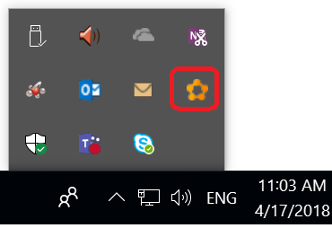
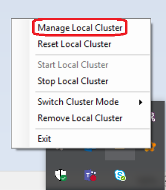

# Service Fabric integration sample

This project showcases how to to use YARP with dynamic configuration discovery using Service Fabric.
To learn more about Service Fabric, see: https://azure.microsoft.com/services/service-fabric/


# Architectural Overview

This sample project is an ASP .NET Core application that uses YARP to implement a full-featured reverse proxy
that can manage HTTP/HTTPS traffic ingress to a Service Fabric cluster, including support for gRPC and Web Sockets.

The sample project shows how one can configure YARP using a combination of application conffiguration (e.g. `appsettings.json`)
as well as dynamic configuration that leverages Service Fabric API's to discover services that opt-in to this traffic ingress solution.

A pre-req for running this project is to do so in a machine that is already part of a Service Fabric cluster.
This project connects to the Service Fabric API's using the Service Fabric client libraries,
and as such it will automatically detect and connect to the Service Fabric cluster that the machine is a part of.

In production scenarios, the standard way to deploy this solution is to create a Service Fabric Application
which includes a service that replicates this sample and ties in to the Service Fabric reliable services model.


# Running locally

You can run this locally by setting up a local Service Fabric development environment --
Service Fabric installers will guide you through the process to install and create a local Service Fabric cluster
which runs like any other piece of software on your development machine.
You do NOT need to provision an Azure Service Fabric cluster in the cloud to try this out,
although it will also work in that setting and is ultimately what this is designed for.

Step-by-step instructions follow:

1. Follow Service Fabric's [Prepare your development environment on Windows](https://docs.microsoft.com/azure/service-fabric/service-fabric-get-started) guide. Specifically:

    * Install the [Service Fabric SDK and runtime](https://www.microsoft.com/web/handlers/webpi.ashx?command=getinstallerredirect&appid=MicrosoftAzure-ServiceFabric-CoreSDK)

    * Ensure you can access and manage the local Service Fabric cluster. Look for the Service Fabric icon in the system tray, and click `Manage Local Cluster`.

        

        


2. Run this sample project. You should see in the console output a line that looks like `Discovered 0 backends, 0 routes.` every few seconds (interval is configured in `appsettings.json` as configuration parameter `ServiceFabricDiscovery:DiscoveryPeriod`, 5 seconds by default)

3. To exercise reverse proxying end-to-end with Service Fabric, you will also need to setup an example destination service that YARP will proxy to. See the next section for instructions.


# Creating a sample destination Service Fabric service

The steps above are all you need to run YARP with dynamic Service Fabric service discovery.
The next step is to configure your destination services (the destinations that YARP will proxy requests to).

If you already have a service that you would like to expose with YARP, see the next subsection `Service manifest changes`.


## Creating a Service Fabric service / application

See for example [Create an ASP.NET Web API service as a reliable service](https://docs.microsoft.com/azure/service-fabric/service-fabric-tutorial-create-dotnet-app#create-an-aspnet-web-api-service-as-a-reliable-service).

If you intend to use gRPC, make sure to use HTTPS everywhere. gRPC relies on HTTP/2, and HTTP/2 negotiation relies on ALPN, a feature of TLS that is, for that reason, only available with encrypted transports.


## Modifying your ServiceManifest

Find the Service Manifest XML file for your Service Fabric service (look under `PackageRoots\ServiceManifest.xml`).
You will need to add the lines indicated below. A brief explanation of labels is indicated below.

```diff
 <ServiceManifest Name="Service1Pkg" Version="1.0.0" xmlns="http://schemas.microsoft.com/2011/01/fabric">
   <ServiceTypes>
     <StatelessServiceType ServiceTypeName="Service1Type" >
       <Extensions>
+        <Extension Name="YARP-preview">
+          <Labels xmlns="http://schemas.microsoft.com/2015/03/fabact-no-schema">
+            <Label Key="YARP.Enable">true</Label>
+            <Label Key="YARP.Routes.route1.Path">{**catchall}</Label>
+            <!-- Optional: enable active health probes -->
+            <Label Key="YARP.Backend.HealthCheck.Active.Enabled">true</Label>
+            <Label Key="YARP.Backend.HealthCheck.Active.Timeout">30</Label>
+            <Label Key="YARP.Backend.HealthCheck.Active.Interval">10</Label>
+            <Label Key="YARP.Backend.HealthCheck.Active.Policy">ConsecutiveFailures</Label>
+          </Labels>
+        </Extension>
       </Extensions>
     </StatelessServiceType>
   </ServiceTypes>
 
   <!-- ... -->
 </ServiceManifest>
```

#### Understanding the labels

Label|Value|Explanation
-|-|-
`YARP.Enable`|`true`|Opt-ins to serving traffic through YARP with Service Fabric dynamic service discovery
`YARP.Routes.route1.Path`|`{**catchall}`|Configures a route, named `route1`, that will match requests with any path. Any [ASP .NET Core route template](https://docs.microsoft.com/aspnet/core/fundamentals/routing#route-template-reference) is allowed
`YARP.Routes.route1.Hosts`|`example.com`|Configures a route, named `route1`, that will match requests with host name `example.com`. If both `Hosts` and `Path` are added, only requests matching **both** will resolve to this route.
`YARP.Backend.HealthCheck.Active.*`|`...`|Configures active health checks. YARP will probe each replica of the service at the configured cadence at the provided path.


> NOTE: Label values can use the special syntax `[AppParamName]` to reference an application parameter with the name given within square brackets. This is consistent with Service Fabric conventions, see e.g. [using parameters in Service Fabric](https://docs.microsoft.com/azure/service-fabric/service-fabric-how-to-specify-port-number-using-parameters).
